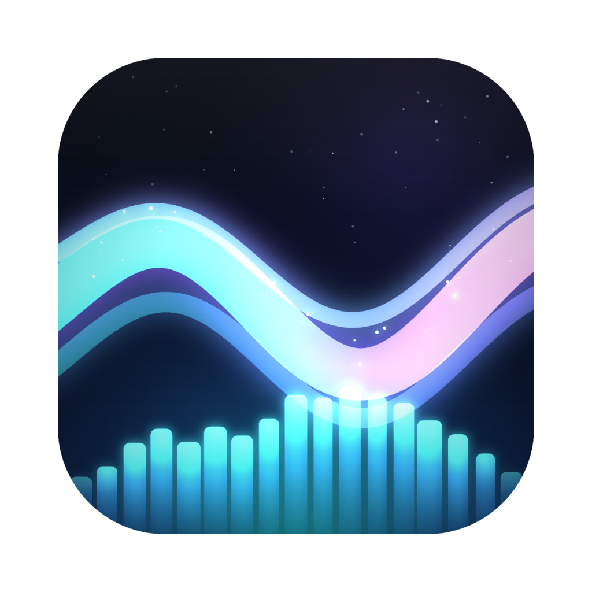

<div align="center">



# Yinlang Wallpaper (音浪壁纸)

**A macOS live wallpaper that makes your desktop breathe with music**

[中文](README.md) | English

</div>

---

Yinlang Wallpaper covers your desktop with a glowing voxel terrain rendered in three.js: aurora curtains drift across the sky, stars twinkle slowly, and the occasional meteor streaks by. Play a song and the whole landscape moves to the rhythm — bass lifts waves out of the ground, kick drums burst into ripples and lightning, and highs make the stardust sparkle. Even with no music playing, it keeps breathing gently.

## Features

- **Three audio sources**
  - **System audio**: captures whatever your Mac is playing (browser, Spotify, anything) — no microphone needed. Built on a ScreenCaptureKit → Rust FFT spectrum pipeline
  - **Microphone**: react to ambient sound
  - **Local music files**: mp3 / wav / flac / m4a / aac / ogg
- **Six color themes**: Nocturnal · Neon Tokyo · Cyber Forest · Ink Wash (inverted ink-on-paper rendering) · Minimal Mono · Dawn
- **A full scene stack**: gradient sky dome with nebula, 650 twinkling stars and meteors, surrounding aurora curtains, floating dust motes, beat-triggered lightning, vignette & film grain post-processing
- **Idle breathing**: with no audio source, soft light waves and automatic ripples keep the wallpaper alive
- **Multi-monitor**: one wallpaper window per display, themes and rhythm fully in sync
- **Interactive mode**: click the terrain to spawn ripples; otherwise the wallpaper is fully click-through and never gets in your way
- **Tray-only control**: audio source / themes / clock / interactive mode, no Dock icon

## Install

Download the `.dmg` from [Releases](../../releases) (Apple Silicon / macOS 13+) and drag it into Applications.

> The first time you enable **System Audio**, macOS will ask for the "Screen & System Audio Recording" permission (audio only, no video is recorded). **Restart the app once** after granting it.

## Usage

Click the tray icon in the menu bar:

| Menu item | What it does |
|---|---|
| Pick music file… | Drive the wallpaper with a local audio file |
| System audio | React to anything your Mac plays (recommended) |
| Microphone | React to ambient sound |
| Color themes | Six to choose from, switch anytime |
| Show clock | Centered desktop clock |
| Interactive mode | Make the wallpaper clickable; click terrain for ripples |

## Build from source

Requirements: Rust ≥ 1.77, Node ≥ 18, pnpm, Xcode Command Line Tools

```bash
pnpm install
pnpm tauri dev     # run in dev mode
pnpm tauri build   # produce .app / .dmg
```

Debug tip: open `src/index.html?demo=1` directly in a browser to preview the visuals with a synthetic spectrum — no real audio source needed.

## Tech

Tauri 2 + vanilla JS + three.js (vendored locally, zero runtime CDN). The wallpaper window sits at the macOS desktop window level (`kCGDesktopWindowLevel`) — below desktop icons, above the system wallpaper. The system-audio path is: Swift helper (ScreenCaptureKit) → Rust (rustfft, Blackman window) → 47 Hz spectrum events → WebGL shaders.

## Roadmap

- [ ] Windows support (WorkerW wallpaper injection + WASAPI loopback)
- [ ] Monitor hot-plug handling
- [ ] Pause rendering when fully occluded (battery)
- [ ] Launch at login / notarized builds
